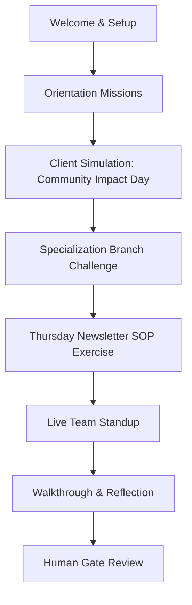

# PWA Skills Trial — Phase 2: Candidate Experience & World Design

## 1. Journey Overview
The trial runs across 5 to 7 calendar days, simulating a candidate's first week. The progression consists of:

---

## 2. The Simulated World
The candidate joins a fictional Pure Water workspace. They interact with:
* **Purii (AI Coordinator):** Disclosed AI assistant who schedules, reminds, and checks on blockers.
* **Sarah (AI Project Manager):** Assigns work and returns revisions based on criteria.
* **Emily (AI Senior VA):** Answers workflow questions and provides guidance.
* **Michael (AI Client):** Busy, occasionally unclear simulated client who mimics real-world feedback.
* **Human Reviewers (Eunmi / Justin):** Review final evidence packets and conduct live touches.

---

## 3. Daily Rhythm
To simulate a real remote job, the candidate experiences a structured daily schedule:

### Morning
* **Daily Briefing:** Purii sends a message summary of the day's focus.
* **Schedule Reminder:** Verification of planned work windows.

### Work Block
* Candidate opens **Mission Control**, turns on the step timer, and completes assignments.
* Emily is available for workflow queries.

### Afternoon
* Simulates unexpected operational events (e.g. client feedback, requests for revised ETAs, or blocker reports).

### Wrap-Up
* **Daily Check-In:** Purii collects a status update (Completed, Next Steps, Blockers, ETA changes).

---

## 4. Availability & Working Windows
Candidates declare their timezone and preferred work windows on Day 0 (e.g., Morning, Afternoon, or Evening on specific days).
* **Rule:** Response times and missed deadline flags are calculated **only** within these declared windows to prevent timezone penalties or unfair pressure.
