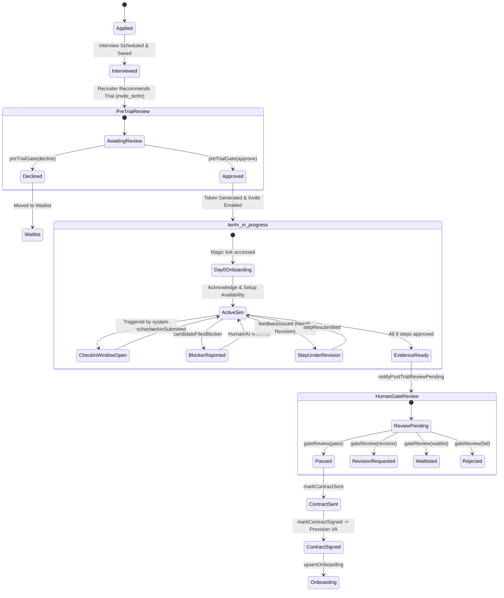
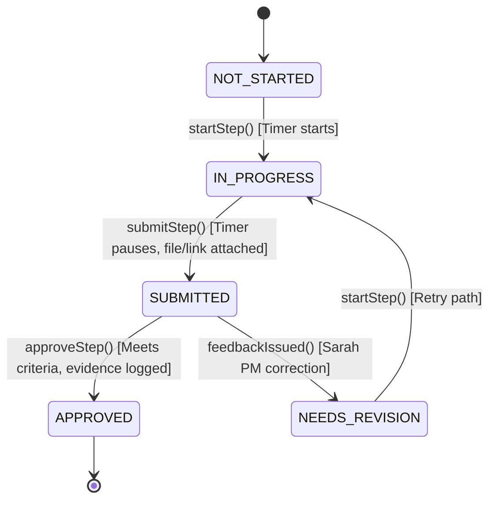

# PWA Skills Trial — Appendix B: State Machines

This document contains Mermaid diagrams defining the transitions, triggers, and states of the Skills Trial.

---

## 1. Candidate Journey State Machine

---

## 2. Mission/Step Lifecycle State Machine

